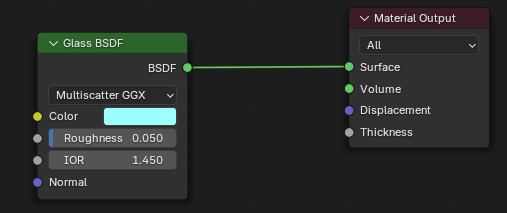

# SPH Fluid Simulation Engine

## Benchmarking (benchmarking.py)
| Computer | Total Time (s) | Time per Step (s) |
|---------|----------| ----------------|
| Intel i5-10210U CPU | 196.2 | 0.20 |


## Blender import fluid meshes script

Blender script to import 3D meshes from a folder and animate them in Blender.
The script assumes the meshes are named in the format `frame_XXXX.obj` where `XXXX` is the frame number.

```py
import bpy
import re
import os
import logging
import sys

formatter = logging.Formatter('%(message)s')
console_handler = logging.StreamHandler(sys.stdout)
console_handler.setFormatter(formatter)

def import_and_animate_objs(folder):
    mat = bpy.data.materials.new(name="Fluid")
    mat.diffuse_color = (0,0.2,1,1)

    # Make sure the OBJ importer is available
    try:
        bpy.ops.preferences.addon_enable(module="io_scene_obj")
    except Exception as e:
        print("Could not enable the io_scene_obj add-on:", e)
    
    # Ensure we're in object mode
    if bpy.context.object and bpy.context.object.mode != 'OBJECT':
        bpy.ops.object.mode_set(mode='OBJECT')

    for filename in os.listdir(folder):
        if filename.lower().endswith(".obj"):
            # Attempt to extract frame number from filenames like: frame_0049.obj
            match = re.search(r"frame_(\d+)\.obj", filename)
            if not match:
                # Skip files that don't match the pattern
                continue
            frame_num = int(match.group(1))
            filepath = os.path.join(folder, filename)
            
            # Import OBJ
            bpy.ops.wm.obj_import(filepath=filepath)
            
            # Grab all imported objects (they should remain selected)
            imported_objects = bpy.context.selected_objects
            
            # Animate the visibility of each imported object
            for obj in imported_objects:
                # Add material
                obj.data.materials.append(mat)
                
                # Hide one frame before
                bpy.context.scene.frame_set(frame_num - 1)
                obj.hide_viewport = True
                obj.hide_render = True
                obj.keyframe_insert(data_path="hide_viewport")
                obj.keyframe_insert(data_path="hide_render")
                
                # Show on the target frame
                bpy.context.scene.frame_set(frame_num)
                obj.hide_viewport = False
                obj.hide_render = False
                obj.keyframe_insert(data_path="hide_viewport")
                obj.keyframe_insert(data_path="hide_render")
                
                # Hide one frame after
                bpy.context.scene.frame_set(frame_num + 1)
                obj.hide_viewport = True
                obj.hide_render = True
                obj.keyframe_insert(data_path="hide_viewport")
                obj.keyframe_insert(data_path="hide_render")
                
folder = r"C:/Users/user/path/to_repo/06_SPH_fluid_sim_engine/test/output"

# Run the importer/animator
import_and_animate_objs(folder)
```

## Blender Rendering

The visuals were rendered using cycles (Eevee did not have as good shadow / caustics) using the following material setup:



Cycles settings:
```
Samples: 32
Denoise: on (OpenImageDenoise set to High)
Noise Threshold: off
Otherwise default
```