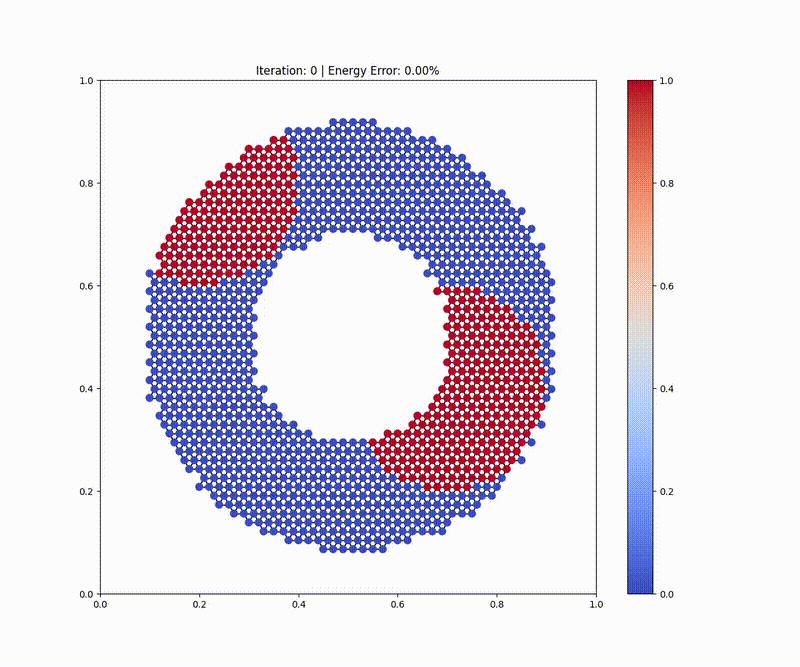
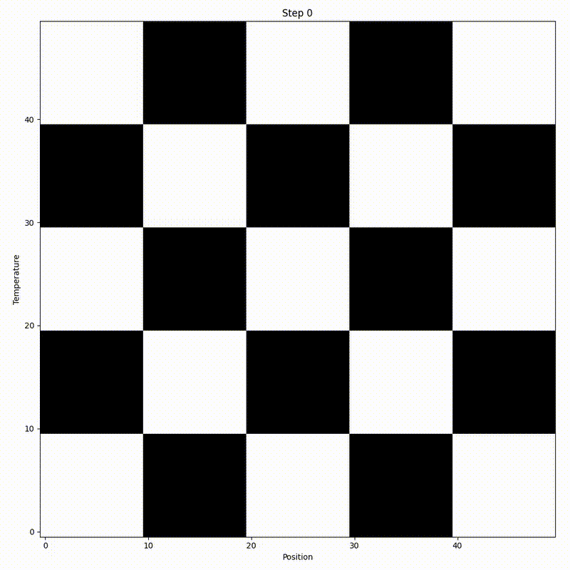
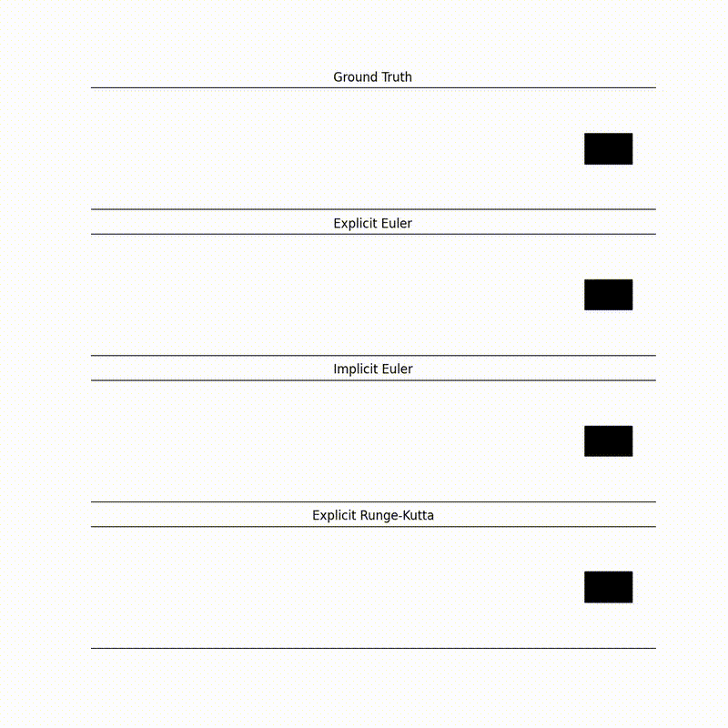

# Simulations

This repo contains the code for simulations I used to teach myself about various topics in numerical analysis and scientific computing.

---
Experiment # | Simulation | Method | Technologies
--- | --- | --- | ---
01 | Mass Spring Oscillator | Forward Euler, Backward Euler, and Runge-Kutta 4th Order | Python, NumPy, Matplotlib
02 | 1D Heat Diffusion | Finite Difference Method | Python, NumPy, Matplotlib
03 | 2D Heat Diffusion | Finite Difference Method | Python, NumPy, Matplotlib, , SciPy
04 | 2D Heat Diffusion | Finite Volume Method | Python, NumPy, Matplotlib, SciPy
05 | 2D Fluid Simulation | Smoothed Particle Hydrodynamics | Python, NumPy, Matplotlib, JAX, VisPy

# Visualizations

## SPH 2D Fluid Simulation

## FVM 2D Heat Diffusion

## FDM 2D Heat Diffusion

## FDM 1D Heat Diffusion

## Mass Spring Oscillator
