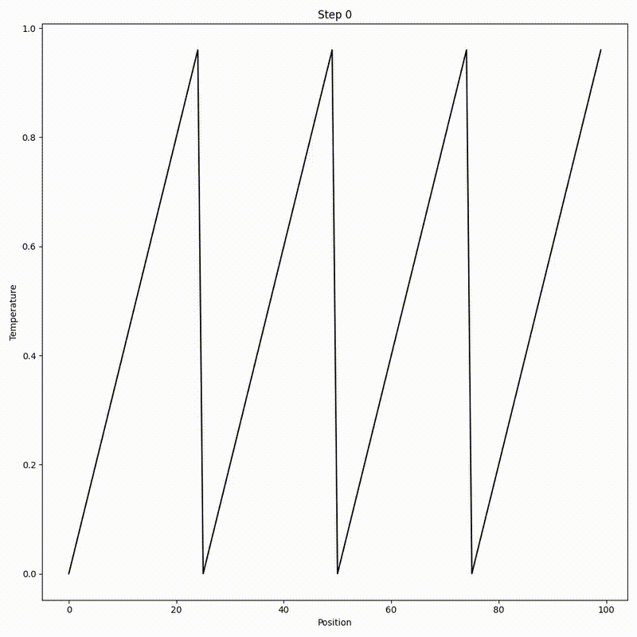

# Simulations

This repo contains the code for simulations I used to teach myself about various topics in numerical analysis and scientific computing.

---
Experiment # | Simulation | Method | Technologies
--- | --- | --- | ---
01 | Mass Spring Oscillator | Forward Euler, Backward Euler, and Runge-Kutta 4th Order | NumPy, Matplotlib
02 | 1D Heat Diffusion | Finite Difference Method | NumPy, Matplotlib
03 | 2D Heat Diffusion | Finite Difference Method | NumPy, Matplotlib, , SciPy
04 | 2D Heat Diffusion | Finite Volume Method | NumPy, Matplotlib, SciPy
05 | 2D Fluid Simulation | Smoothed Particle Hydrodynamics | NumPy, Matplotlib, JAX, VisPy
06 | 3D Fluid Simulation | Smoothed Particle Hydrodynamics | NumPy, Matplotlib, JAX, VisPy, Blender
07 | 2D Cloth Simulation | Variational Implicit Euler for Energy Minimization | NumPy, Matplotlib

# Visualizations

## SPH 3D Fluid Simulation (Rendered in Blender)

## SPH 2D Fluid Simulation

## VIE Cloth Simulation

## FVM 2D Heat Diffusion

## FDM 2D Heat Diffusion

## FDM 1D Heat Diffusion

## Mass Spring Oscillator
